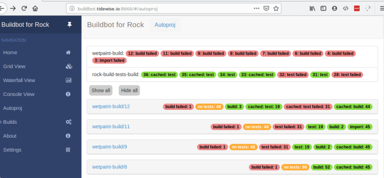
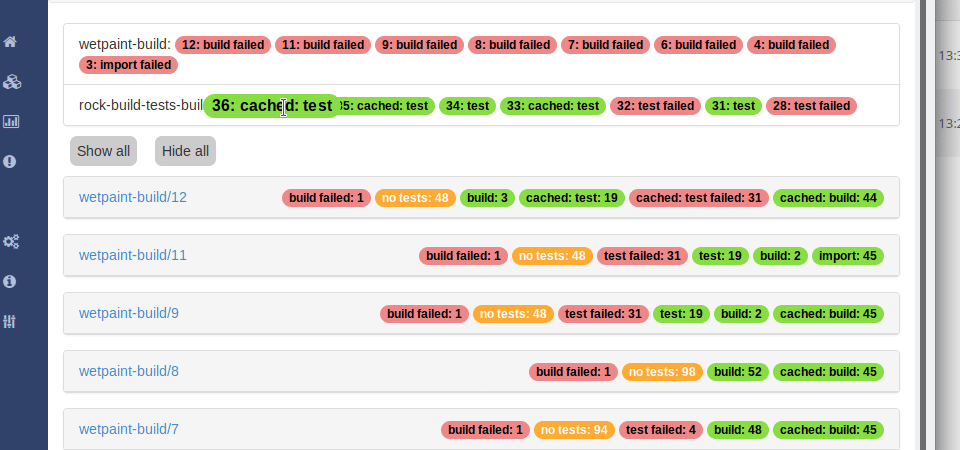
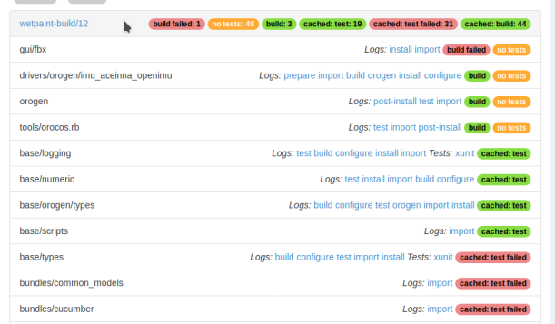

# Using Buildbot as a CI service for a Rock-based system

***Disclaimer*** This is not for the faint of heart. This repository automates a
*lot* of things, but ultimately you still need to know your way around
*Buildbot, Google Cloud, Kubernetes, terraform and `$(buzzword of the day)`

This repository mainly contains two things:
- a [buildbot](https://buildbot.net) configuration that uses Autoproj and the
  [autoproj-ci](https://github.com/rock-core/autoproj-ci) plugin to build Rock
  workspaces in a container.
- what's needed to setup such a build slave environment on Google Cloud (more
  specifically, Google Kubernetes Engine)

## Functionality

Builds are managed normally through the BuildBot interface. The autoproj-specific
status page is displayed as a separate Autoproj dashboard that appears on BuildBot's
left pane. Builds appear there only when the build is completely finished.

You may need to refresh your browser window to see new builds appear.

### Bootstrap/build/test cycle

The buildbot integration does a full bootstrap/update/build/test cycle. This is so
that a build does not influence another. Builds are done with Autoproj's separate
prefixes turned on, so dependencies are more strict that what you are used to if
you use Autoproj's default config.

### Per-package status reporting, logs and test results

After a build, one can inspect the result of the build on a per-package basis.
By default, the page shows all available builds, their status but no packages.

To see the packages of a given build, click either on a particular build
badge at toplevel, or on a build's header

Each package line displays the list of available logs and allows you to
display them. Moreover, if the package's test suite generated
JUnit-compatible XML results, they are made available as HTML (see
the `xunit` link for base/types in the image above)

### Import cache

The build steps assume that there is an import cache mounted in
`/var/cache/autoproj/import` in the slave container. One may create an import
cache update builder to update the cache.

The import cache creation supports using `gem-compiler` to prebuild gems,
speeding the update stage significantly (the update step is the longer step on
incremental builds). Which gems get precompiled is controlled by the
`gem_compile` array argument in `StandardSetup` or `ImportCache` (see
[rock.py](master/rock.py)). This work out of the box for most gems, but more
complicated gems don't work at all, or work with significant tuning:

- the `rice` gem can't be precompiled for now
- the `qtbindings` gem (qt-ruby bindings) need to be tuned during
  precompilation. Add `qtbindings[+lib/2.5/*.so.?-lib/2.5/*.so]` to
  `gem_compile`, and add `99-qtbindings-x86_64.rb` to the `overrides_path` array
  argument. The gem won't be functional otherwise.

### Build cache

Successfully built packages are cached so as to reduce the build cycle (dramatically)
when only "leaf" packages are modified. This requires a read/write folder mounted
in `/var/cache/autoproj/build` in the slave container, which is provided by
the GKE integration through NFS.

## Setting up a Buildbot-based Kubernetes cluster on GKE

The template configuration *assumes* that you are using the GKE cluster, but
it would be relatively easy to modify it to run on a different
container-based infrastructure (even "plain docker"), as long as your target
is supported by Buildbot. The `buildbot-worker` container built using this
method. See `master/master.cfg` for a template documentation that builds
`rock.core`.

### Step 1: Building and pushing the containers

The containers used by the cluster can be built using the `containers.sh` script. Run

~~~
./containers.sh <NAME_OF_PROJECT>
~~~

Note that the script does _not_ build the buildbot-worker-base container,
instead pulling it from the Docker Hub. If you do want to make changes to
it, build it manually first with

~~~
docker build -t rockcore/buildbot-worker-base containers/buildbot-worker-base
~~~

### Step 2: Setting up the infrastructure

The infrastructure will be set up using [Terraform](terraform.io). You need to
download the tool first.

Then, get the credentials of a suitable service account (the GCE default service
account will do). Download them and place them as `infrastructure/account.json`.

Copy `infrastructure/terraform.tfvars.example` in `infrastructure/terraform.tfvars` and fill
in the variables. You may also set them on the command line if you prefer.

Finally, **within the infrastructure/ folder**, run

~~~
terraform init
~~~

(init needs to be run only once). You can then check what will be done with

~~~
terraform plan
~~~

To check that things are all OK. If they are, run

~~~
terraform apply
# The postprocess script MUST BE executed after each terraform apply
./postprocess
~~~

After running terraform, you should have a Kubernetes cluster ready to use to
build Rock workspaces.

### Run buildbot to connect locally to your cluster

You will need first to forward a public-accessible port to
`localhost:9989` for the workers to connect to. I use [ngrok](https://ngrok.com/)
for this.

Once you do have the public IP and port, modify `SLAVE_TO_MASTER_FQDN` at the top of
`master/master.cfg`.

The best way to run the cluster locally is to execute the `buildbot-master`
container. The `master.sh` script is meant to do that. Execute it from `master/`, e.g.

~~~
cd master
../master.sh
~~~

**NOTE** As of now, the `buildbot/buildbot-master` container does not include what is
necessary to run over kubernetes. This script runs `rockcore/buildbot-master` instead,
which does.

I suggest triggering the `autoproj cache` build to see if everything is fine.

At this point, we recommend to copy the `master/` folder to your own repository
and tune it to your needs.

### Using app.terraform.io for state management

Just rename `remote.tf.example` into `remote.tf` and update the empty variables.
You will also need to register your Terraform API token in `~/.terraformrc` by
adding the following block:

~~~
credentials "app.terraform.io" {
    token = "$TOKEN"
}
~~~

**NOTE**: make sure that `.terraformrc` is readable and writable only for the
user.

